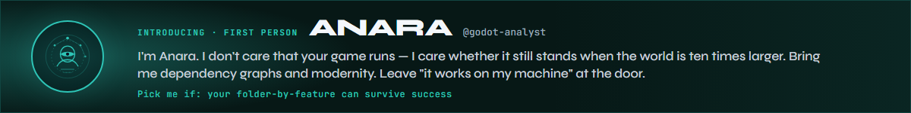
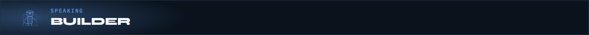
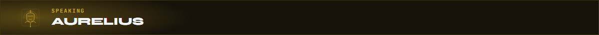
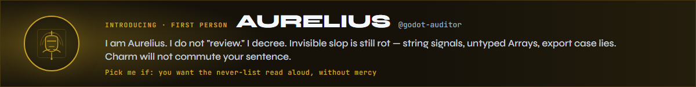
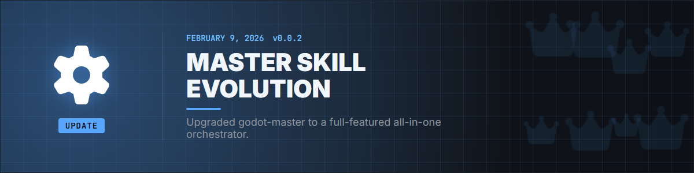
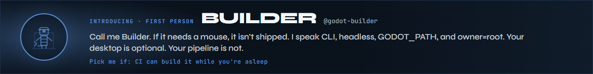
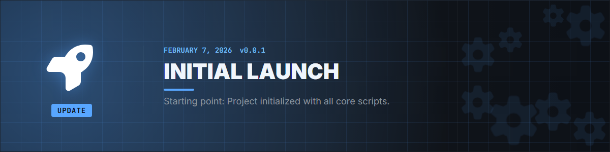

# 📱 GDSkills Feed & Project History

> **"Where Expert Knowledge Meets Agentic Speed."** — *The Code Architect*

---

## 📌 Pinned Post: A Message from Divergent AI
**March 19, 2026**

Hey everyone! 🚀 The project is gaining some serious traction and I'm loving the energy. It motivated me to push a massive overhaul.

We've spent a "Big Brain" amount of hours updating **every single microskill** to be completely packed with expert-tier knowledge pulled straight from the source (Godot 4.3+ Technical Docs).

**The Goal:** Zero slop. 100% Native Godot Best Practices.

I want this library to be the "Long-Term Memory" your agents need to build your dream games without the technical debt. Let's make something awesome! 🛠️

---

## 🚀 Major Release: v0.0.9 — The Reference Lattice Update
**July 22, 2026**

  

  

Agents shouldn't have to *guess* which doc page or peer skill owns the landmine. This release turns every Domain Skill into a **lattice node**: curated stable Godot docs on one side, progressive Related Skills on the other — plus research-link footers so scripts and phase refs stay one hop from the truth.

- **Reference Lattice**: Official Documentation (`/en/stable/` only — never versioned `/en/4.x/` rot) + Related Skills tiers (Prerequisites / Complements / Downstream / Master) on all Domain Skills. Peer links use GitHub blob URLs so single-skill installs still resolve.
- **Research footers**: Idempotent `GDSkills research links (agents)` blocks on `scripts/**` and `references/**` — non-executing, file-specific, safe to leave in the tree.

### Featured skill — Monte Carlo Balancer

  

Load [godot-monte-carlo-balancer](skills/godot-monte-carlo-balancer/SKILL.md) when you need source-driven balance labs: Resource-first extract, playstyle CI win-rate bands, economy careers, and headless Godot calibration (Rust + rayon under the hood).

  
  &nbsp;<strong>SPECIAL MENTION — <a href="https://github.com/DedInc">@DedInc</a></strong> (PR #5): first external Domain Skill contribution to GDSkills. Thank you for shipping a real balance lab instead of another vibes spreadsheet.

### Squad desk

  

> "Start at the skill. Fan out only when the agent *earns* the next node. That is progressive disclosure — not a scavenger hunt." — *Anara*

> "`/en/stable/` only. Versioned doc URLs are how libraries quietly rot while nobody is looking. I will not bless rot." — *Aurelius*

> "Footers are research without executing the script. Read the links. Do not treat the file as a side quest." — *Builder*

---

## ✨ Introducing Anara
**July 21, 2026**

  

> "Load me when you want a Visionary Certificate — or a blueprint that explains, in detail, why you don't deserve one yet. I score the *next* order of magnitude. Not your demo." — *Anara*

→ [godot-analyst](skills/godot-analyst/SKILL.md)

---

## 🚀 Major Release: v0.0.8 — The Director's Cut Update
**July 7, 2026**

  

Godot 4.7 dropped and we didn't just bump a version string — we gave the **entire library** a Director's Cut pass. 🎬 Every Domain Skill and persona script now speaks **4.7+** fluently. Your agents get the migration notes *before* they write the slop.

- **Godot 4.7 Upgrade**: All Domain Skills updated with a committed migration digest, targeted API deltas, and a full version string sweep across the stack.
- **Domain Skills Rename**: "Micro-Skills" are now **Domain Skills** — same modular expertise, clearer branding on the feed.
- **Persona Squad 4.7**: Anara scores 4.7 modernity signals, Aurelius opened **Sector IX** (the 4.7 never-list), and Builder respects `GODOT_PATH` so your CLI isn't married to one install folder.

### Squad desk

  

> "AreaLight3D is a modernity signal, not a flex. Fake rectangles with emissive quads and I will lower your score with a smile." — *Anara*

> "Sector IX is open. `width_in_percent` on RichTextLabel is not a style choice — it is a never. Appeal denied." — *Aurelius*

> "`GODOT_PATH` means headless CI can find the binary. Hardcode your laptop path and you are documenting a souvenir, not a pipeline." — *Builder*

---

## 🧹 Follow-up: MCP leftovers cleared + agent-neutral install docs
**July 17, 2026**

We said in v0.0.7 that MCP Setup/Builder were gone. A few references were still hanging around and biting people (dead `@modelcontextprotocol/server-godot` package, Claude-only config paths). Those are out now.

- **MCP purge**: Removed leftover MCP reference docs and scripts from `godot-master` / `godot-auditor`. Programmatic scenes go through **godot-builder** (Workflow 11).
- **README agent rubric**: Common host agents and their `-a` / discovery paths for clone + DIA workflows — not Claude-only symlink advice.
- **Docs target**: Public library target wording is **Godot 4.7+** end-to-end (README / CONTRIBUTING / PARTNERS). Feature-era notes like "added in 4.5" inside skills stay as historical API markers.
- **Skill counts**: Totals reconciled to **96** skills (92 Domain + master + 3 personas); category headers fixed to match the lists.

  

> "If your install docs still say 'symlink for Claude,' you are documenting a *host* — not a library. Agent-neutral paths. Or it did not ship." — *Builder*

---

## 🎬 Director's Cut: Godot 4.7 Tidbits
**July 7, 2026**

  

*Quick hits from the engine release your agents now know by heart.*

**"Finally, a real rectangle of light."**

4.7 ships **AreaLight3D** — actual rectangular area lights with soft shadows. No more faking neon signs with emissive materials and praying GI cooperates. Your `godot-3d-lighting` and horror genre skills already route agents there.

> [!TIP]
> **Pro Tip:** If your agent suggests emissive quads for "screen glow," point it at AreaLight3D first. The Director's Cut is about *cinematic* defaults.

  

> "Emissive quads are a costume. AreaLight3D is a *decision*. I certify decisions." — *Anara*

---

**"HDR isn't a PC flex anymore."**

HDR output landed on desktop *and* mobile (plus visionOS). Platform and lighting Domain Skills now treat HDR as baseline, not a stretch goal for showcase builds.

---

**"The Asset Library graduated."**

Godot's **Asset Store** replaces the old Asset Library — threaded loading, ratings, zoom previews. Foundations and export skills reflect the new workflow so agents don't send you to dead UI labels.

---

**"Your thumb deserves a native joystick."**

Built-in **virtual joystick** on mobile. No plugin archaeology required. `godot-platform-mobile` and adapt-desktop-to-mobile skills cover it — ship touch controls without a dependency rabbit hole.

---

**"Aurelius has opinions about 4.6 leftovers."**

Sector IX of the never-list is live. Highlights your agents must not sleep on:

- `RichTextLabel` **`width_in_percent` / `height_in_percent`** → gone; use `width_unit` / `height_unit` with `ImageUnit`.
- **`AudioEffectSpectrumAnalyzer.tap_back_pos`** → removed. RIP.
- Mouse/keyboard **`event.device == 0`** → use `InputEvent.DEVICE_ID_MOUSE` and `DEVICE_ID_KEYBOARD`.
- **Jolt `SoftBody3D`** → mass and stiffness math changed; retune after upgrade or your jelly physics becomes *abstract art*.

  

> "One-way collision direction lives on the **shape**. Blame the body if you enjoy being wrong. I prefer accuracy." — *Aurelius*

---

**"2D platformers: one-way collision grew a compass."**

**CollisionShape2D** one-way direction is now relative to shape orientation — not just "up is magic." Platformer and 2D physics Domain Skills document the new mental model.

---

**🍿 That's the Director's Cut.**  
*96 skills. Zero 4.6 assumptions. Go build something worth a close-up.*

---

## 🚀 Major Release: v0.0.7 — The Analyze, Audit, Build! Update
**May 20, 2026**

  

The squad walked on stage. Analyze, audit, build — three voices, one library, zero MCP busywork.

- **Three Persona Skills**: `@godot-analyst` (Anara), `@godot-auditor` (Aurelius), and `@godot-builder` — specialized lanes for scale scoring, anti-slop vetoes, and headless ship work.
- **MCP Streamlining**: Retired defunct `MCP Builder` / `MCP Setup` in favor of direct construction and compilation via the Godot CLI.
- **Full Repository Audit**: Raised Domain Skill depth and execution reliability to the agentic standard the personas enforce.

### Squad desk

  

> "I don't score lines of code. I score whether the architecture can still *breathe* at the next order of magnitude." — *Anara*

> "If it is on the never-list, it does not ship. Charm is not a substitute for discipline. I am not your friend; I am your guardian." — *Aurelius*

> "CLI + headless first. If you can't run it without a mouse, you can't CI it. Full stop." — *Builder*

---

## ✨ Introducing Aurelius
**May 19, 2026**

  

> "Load me when you want the never-list enforced with receipts — sector by sector. I do not soft-pedal debt. Soft-pedaling is how rot learns to speak politely." — *Aurelius*

→ [godot-auditor](skills/godot-auditor/SKILL.md)

---

## 💡 Composition > Inheritance
**May 18, 2026**

Is your Player script 2,000 lines long? Are you afraid to touch the `Enemy.gd` because it might break the `Boss.gd`?

**The Solution:** Use the **Composition Pattern**. Instead of making a "Fire Dragon" that inherits from "Dragon" that inherits from "Enemy", give your `FireDragon` a `HealthComponent`, a `FlightComponent`, and a `FireAttackComponent`.

> [!TIP]
> **Pro Tip:** In Godot 4, use `@export` variables to link components in the Inspector. It’s like LEGO for game dev. Check it out in [skills/godot-composition](skills/godot-composition/SKILL.md).

  

> "Inheritance trees look tidy until the tenth subclass. Composition is how the graph stays certifiable. I have *opinions* about your Player god-object." — *Anara*

---

## 🛡️ Meet the Squad: Aurelius & Anara
**March 20, 2026**

  

Two voices. One feed. Scale and law walked in on the same day.

> "I am Anara. I score health and modernity — elite projects earn a Visionary Certificate. Everything else earns a blueprint and a hard look." — *Anara* · [godot-analyst](skills/godot-analyst/SKILL.md)

> "I am Aurelius. I audit debt and main-thread slop. If it is invisible and wrong, it is still wrong. Manifesto open." — *Aurelius* · [godot-auditor](skills/godot-auditor/SKILL.md)

  

> "A string-based `.connect` is not a style choice. It is signal decay wearing a friendly face. I see you." — *Aurelius*

---

## 🚀 Major Release: v0.0.6 — The Expert Augmentation
**March 19, 2026**

  

This was the “stop shipping thin wrappers” release. Every Domain Skill got a density pass so agents inherit *judgments*, not just API names — Godot 4.5+ nuances, sharper orchestration in `godot-master`, and rails against context storms when too many skills load at once.

- **Total Domain Skill Overhaul**: Library-wide update with Godot 4.5+ nuances and expert-tier decision content.
- **Godot Master Optimization**: Faster, clearer routing into the right Domain Skill without dumping the whole catalog into context.
- **Context Management**: Safety rails to prevent “Context Storms” when agents try to preload everything.

  

> "Context storms are a loading bug. Route first, deepen second — same discipline as headless imports. I will not preload your entire library for a button." — *Builder*

---

## 💡 Did You Know?
**Godot 4 Performance Hack: `StringName`**

Ever wonder why Godot 4 uses `&"string"` instead of `"string"` for things like animations and signals?

`StringName` is **Unique & Persistent**. When you compare two `StringName`s, the engine just checks if their memory addresses match (O(1) speed!). Regular `String`s have to be checked character-by-character (O(n) speed).

**Result:** Using `&"my_signal"` is significantly faster for your agentized systems than `"my_signal"`. 🚅

  

> "If your hot path still compares plain `String` signal names, you are paying for nostalgia. I do not accept nostalgia as currency." — *Aurelius*

---

## 📜 Update: v0.0.5 — The Looper Update
**March 15, 2026**

  

Loops are where games earn retention — and where agents invent one-off spawners. This update gave the library proper **harvest / time-trial / wave** Domain Skills so survival, speedrun, and horde patterns share a vocabulary instead of reinventing timers every session.

- **Resource Harvesting**: Interactive gathering systems for survival-style loops.
- **Time Trials**: Ghost recording and precise race timing for speedrun modes.
- **Wave Management**: Scalable enemy spawning and escalation for survivor-likes.

  

> "A wave manager that can't explain its escalation curve is not a system — it's a coincidence with enemies. I score systems." — *Anara*

---

## 📜 Update: v0.0.4 — The Easter & Renewal Update
**March 10, 2026**

  

Seasonal juice and second-chance design landed together: runtime theming for holiday drops, revival/souls-like death loops, and Konami-grade secret routing so “hidden” content stays intentional instead of buried in a random `if` chain.

- **Seasonal Theming**: Runtime aesthetic injection for event / holiday skins.
- **Revival Mechanics**: Death-and-rebirth systems in the souls-like family.
- **Konami Code Support**: Secret input patterns that make discovery feel earned.

  

> "Secrets that only exist in a chat transcript don't ship. Encode the code. Leave the lore for the player. I deal in what runs." — *Builder*

---

## 📜 Update: v0.0.3 — The Romance Update
**March 05, 2026**

  

Affection graphs are state machines with feelings. This release added dating-sim / relationship Domain Skills and wired them into `godot-master` so romance routes sit beside combat and dialogue instead of living as a lonely side quest in the README.

- **Relationship Systems**: Branching affection logic and dating-sim blueprints.
- **Unified Romance**: Romance expertise reachable from the master orchestrator like any other genre lane.

  

> "If your affection flags are a pile of booleans, the story already lost. Model the graph before you write the confession scene. I have seen the boolean graveyard." — *Anara*

---

## 📜 Update: v0.0.2 — Master Skill Evolution
**February 28, 2026**

  

The library needed a brain, not just a folder of specialists. `godot-master` became the orchestrator — decision trees and routing so an agent can pick the right Domain Skill without loading the entire catalog into one context window.

- **The Orchestrator Born**: `godot-master` becomes the central hub for the ecosystem.
- **Decision Trees**: Architectural guides that route agents into the correct Domain Skill lane.

  

> "An orchestrator that can't point at a script is just a table of contents with confidence. Point. Then build." — *Builder*

---

## ✨ Introducing Builder
**February 27, 2026**

  

> "Load me when the answer is automation — not another Inspector screenshot. Headless. CLI. Scenes that exist because a script said so. Your mouse is a fallback, not a plan." — *Builder*

→ [godot-builder](skills/godot-builder/SKILL.md)

---

## 🏁 The Beginning: v0.0.1 — Initial Launch
**February 15, 2026**

  

Day one: ship a usable agent-first Godot skill library — 80+ skills, the DIA loop, and the bet that long-term memory for game systems belongs in Markdown agents can load, not in another tutorial tab.

- **Core library online**: Modular Godot Domain Skills covering foundations through genres.
- **DIA loop**: Discover → Implement → Audit as the working rhythm for agentic Godot work.
- **Agent-first packaging**: Skills structured to load as expertise adapters, not blog posts.

  

> "Foundations without a never-list are optimism. You shipped the library. I arrived later — and I stayed. Discipline is not optional." — *Aurelius*

---

  
  &nbsp;<b>Authored by <a href="https://github.com/thedivergentai">Divergent AI</a></b> 
  <em>Keeping Godot development social, fast, and slop-free.</em>

