# 📱 GDSkills Feed & Project History

> **"Where Expert Knowledge Meets Agentic Speed."** — *The Code Architect*

---

## 📌 Pinned Post: A Message from Divergent AI
**March 19, 2026**

Hey everyone! 🚀 The project is gaining some serious traction and I'm loving the energy. It motivated me to push a massive overhaul. 

We've spent a "Big Brain" amount of hours updating **every single microskill** to be completely packed with expert-tier knowledge pulled straight from the source (Godot 4.3+ Technical Docs). 

**The Goal:** Zero slop. 100% Native Godot Best Practices. 

I want this library to be the "Long-Term Memory" your agents need to build your dream games without the technical debt. Let's make something awesome! 🛠️

---

## 🚀 Major Release: v0.0.9 — The Reference Lattice Update
**July 22, 2026**

  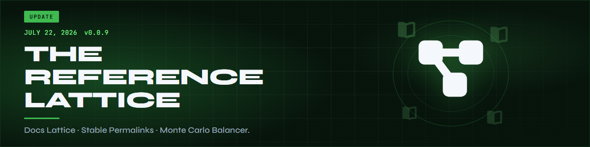

  

Agents shouldn't have to *guess* which doc page or peer skill owns the landmine. This release turns every Domain Skill into a **lattice node**: curated stable Godot docs on one side, progressive Related Skills on the other — plus research-link footers so scripts and phase refs stay one hop from the truth.

- **Reference Lattice**: Official Documentation (`/en/stable/` only — never versioned `/en/4.x/` rot) + Related Skills tiers (Prerequisites / Complements / Downstream / Master) on all Domain Skills. Peer links use GitHub blob URLs so single-skill installs still resolve.
- **Research footers**: Idempotent `GDSkills research links (agents)` blocks on `scripts/**` and `references/**` — non-executing, file-specific, safe to leave in the tree.

### Featured skill — Monte Carlo Balancer

  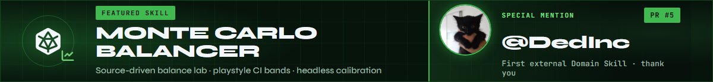

Load [godot-monte-carlo-balancer](skills/godot-monte-carlo-balancer/SKILL.md) when you need source-driven balance labs: Resource-first extract, playstyle CI win-rate bands, economy careers, and headless Godot calibration (Rust + rayon under the hood).

**SPECIAL MENTION — [@DedInc](https://github.com/DedInc)** (PR #5): first external Domain Skill contribution to GDSkills. Thank you for shipping a real balance lab instead of another vibes spreadsheet.

### Squad desk

  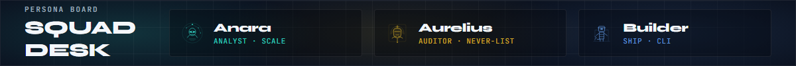

> "The lattice is progressive disclosure done right — start at the skill, fan out only when the agent actually needs the next node." — *Anara (Analyst)*

> "`/en/stable/` only. Versioned doc URLs are how libraries quietly rot while nobody is looking." — *Aurelius (Auditor)*

> "Footers are research without executing the script. Read the links; don't treat the file as a side quest." — *Builder*

---

## 🚀 Major Release: v0.0.8 — The Director's Cut Update
**July 7, 2026**

  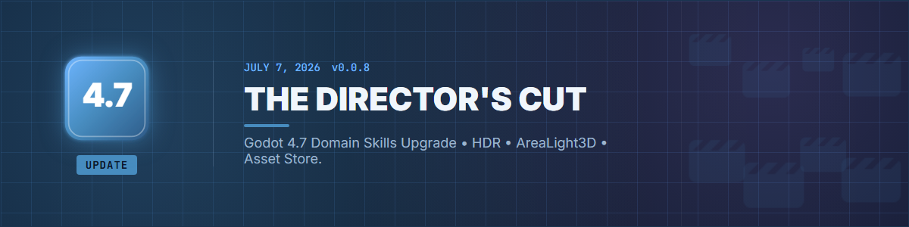

Godot 4.7 dropped and we didn't just bump a version string — we gave the **entire library** a Director's Cut pass. 🎬 Every Domain Skill and persona script now speaks **4.7+** fluently. Your agents get the migration notes *before* they write the slop.

- **Godot 4.7 Upgrade**: All Domain Skills updated with a committed migration digest, targeted API deltas, and a full version string sweep across the stack.
- **Domain Skills Rename**: "Micro-Skills" are now **Domain Skills** — same modular expertise, clearer branding on the feed.
- **Persona Squad 4.7**: Anara scores 4.7 modernity signals, Aurelius opened **Sector IX** (the 4.7 never-list), and Builder respects `GODOT_PATH` so your CLI isn't married to one install folder.

### Squad desk

  

> "AreaLight3D is a modernity signal, not a flex. If your horror lighting still fakes rectangles with emissive quads, the scoreboard notices." — *Anara (Analyst)*

> "Sector IX is open. `width_in_percent` on RichTextLabel is not a style choice — it is a never." — *Aurelius (Auditor)*

> "`GODOT_PATH` means headless CI can find the binary. Stop hardcoding your laptop's install folder into the pipeline." — *Builder*

---

## 🧹 Follow-up: MCP leftovers cleared + agent-neutral install docs
**July 17, 2026**

We said in v0.0.7 that MCP Setup/Builder were gone. A few references were still hanging around and biting people (dead `@modelcontextprotocol/server-godot` package, Claude-only config paths). Those are out now.

- **MCP purge**: Removed leftover MCP reference docs and scripts from `godot-master` / `godot-auditor`. Programmatic scenes go through **godot-builder** (Workflow 11).
- **README agent rubric**: Common host agents and their `-a` / discovery paths for clone + DIA workflows — not Claude-only symlink advice.
- **Docs target**: Public library target wording is **Godot 4.7+** end-to-end (README / CONTRIBUTING / PARTNERS). Feature-era notes like "added in 4.5" inside skills stay as historical API markers.
- **Skill counts**: Totals reconciled to **96** skills (92 Domain + master + 3 personas); category headers fixed to match the lists.

---

## 🎬 Director's Cut: Godot 4.7 Tidbits
**July 7, 2026**

  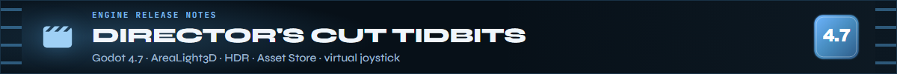

*Quick hits from the engine release your agents now know by heart.*

**"Finally, a real rectangle of light."**

4.7 ships **AreaLight3D** — actual rectangular area lights with soft shadows. No more faking neon signs with emissive materials and praying GI cooperates. Your `godot-3d-lighting` and horror genre skills already route agents there.

> [!TIP]
> **Pro Tip:** If your agent suggests emissive quads for "screen glow," point it at AreaLight3D first. The Director's Cut is about *cinematic* defaults.

---

**"HDR isn't a PC flex anymore."**

HDR output landed on desktop *and* mobile (plus visionOS). Platform and lighting Domain Skills now treat HDR as baseline, not a stretch goal for showcase builds.

---

**"The Asset Library graduated."**

Godot's **Asset Store** replaces the old Asset Library — threaded loading, ratings, zoom previews. Foundations and export skills reflect the new workflow so agents don't send you to dead UI labels.

---

**"Your thumb deserves a native joystick."**

Built-in **virtual joystick** on mobile. No plugin archaeology required. `godot-platform-mobile` and adapt-desktop-to-mobile skills cover it — ship touch controls without a dependency rabbit hole.

---

**"Aurelius has opinions about 4.6 leftovers."**

Sector IX of the never-list is live. Highlights your agents must not sleep on:

- `RichTextLabel` **`width_in_percent` / `height_in_percent`** → gone; use `width_unit` / `height_unit` with `ImageUnit`.
- **`AudioEffectSpectrumAnalyzer.tap_back_pos`** → removed. RIP.
- Mouse/keyboard **`event.device == 0`** → use `InputEvent.DEVICE_ID_MOUSE` and `DEVICE_ID_KEYBOARD`.
- **Jolt `SoftBody3D`** → mass and stiffness math changed; retune after upgrade or your jelly physics becomes *abstract art*.

> "I thought my platformer one-ways were broken. Turns out 4.7 wants one-way direction on the **shape**, not just the body. GDSkills caught it." — *Trial User*

---

**"2D platformers: one-way collision grew a compass."**

**CollisionShape2D** one-way direction is now relative to shape orientation — not just "up is magic." Platformer and 2D physics Domain Skills document the new mental model.

---

**🍿 That's the Director's Cut.**  
*96 skills. Zero 4.6 assumptions. Go build something worth a close-up.*

---

## 🚀 Major Release: v0.0.7 — The Analyze, Audit, Build! Update
**May 20, 2026**

  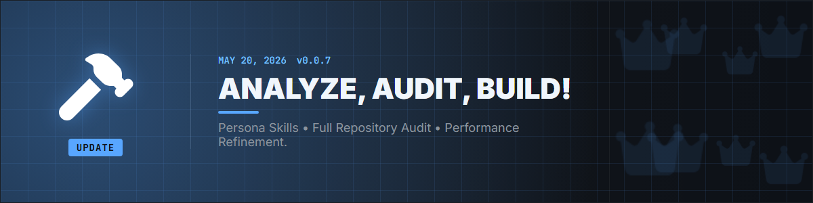

The squad walked on stage. Analyze, audit, build — three voices, one library, zero MCP busywork.

- **Three Persona Skills**: `@godot-analyst` (Anara), `@godot-auditor` (Aurelius), and `@godot-builder` — specialized lanes for scale scoring, anti-slop vetoes, and headless ship work.
- **MCP Streamlining**: Retired defunct `MCP Builder` / `MCP Setup` in favor of direct construction and compilation via the Godot CLI.
- **Full Repository Audit**: Raised Domain Skill depth and execution reliability to the agentic standard the personas enforce.

### Squad desk

  

> "I don't score lines of code — I score whether the architecture can still breathe at the next order of magnitude." — *Anara (Analyst)*

> "If it is on the never-list, it does not ship. Charm is not a substitute for discipline." — *Aurelius (Auditor)*

> "CLI + headless first. If you can't run it without a mouse, you can't CI it." — *Builder*

---
**"Why inherit when you can compose?"**

Is your Player script 2,000 lines long? Are you afraid to touch the `Enemy.gd` because it might break the `Boss.gd`? 

**The Solution:** Use the **Composition Pattern**. Instead of making a "Fire Dragon" that inherits from "Dragon" that inherits from "Enemy", give your `FireDragon` a `HealthComponent`, a `FlightComponent`, and a `FireAttackComponent`.

> [!TIP]
> **Pro Tip:** In Godot 4, use `@export` variables to link components in the Inspector. It’s like LEGO for game dev. Check it out in [skills/godot-composition](skills/godot-composition/SKILL.md).

---

## 🛡️ Meet the Squad: Aurelius & Anara
**March 20, 2026**

  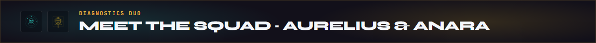

The library just got a major IQ boost. 🧠 Say hello to our new **Expert-Grade Diagnostics Duo**.

- **Aurelius (Auditor)**: The project's "Stoic Parent." He's here to audit your code for technical debt and "Main Thread Slop." He talks like a Roman general but cares like a guardian. Check out his manifesto in `skills/godot-auditor`.
- **Anara (Analyst)**: The "Visionary Hype-Girl." She doesn't just see code; she sees your project's soul. She'll score your health and, if you're elite enough, materialize a **Glassmorphism v2 Certificate** for you.

> "Aurelius found a string-based signal in my Player script and I've never felt more judged... or more safe." — *Trial User*

---

## 🚀 Major Release: v0.0.6 — The Expert Augmentation
**March 19, 2026**

  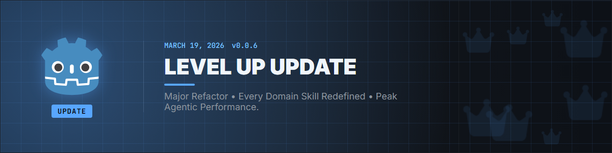

- **Total Microskill Overhaul**: All 94 skills updated with Godot 4.5+ nuances.
- **Godot Master Optimization**: The lead architect is now faster and smarter at orchestrating sub-skills.
- **Context Management**: New safety rails added to prevent "Context Storms."

---

## 💡 Did You Know?
**Godot 4 Performance Hack: `StringName`**

Ever wonder why Godot 4 uses `&"string"` instead of `"string"` for things like animations and signals? 

`StringName` is **Unique & Persistent**. When you compare two `StringName`s, the engine just checks if their memory addresses match (O(1) speed!). Regular `String`s have to be checked character-by-character (O(n) speed). 

**Result:** Using `&"my_signal"` is significantly faster for your agentized systems than `"my_signal"`. 🚅

---

## 📜 Update: v0.0.5 — The Looper Update
**March 15, 2026**

  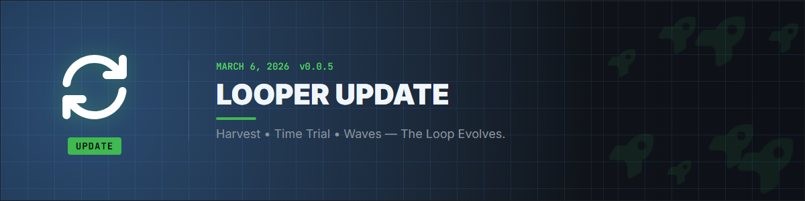

- **Resource Harvesting**: Interactive gathering systems for the survival enthusiasts.
- **Time Trials**: Precise ghost recording for the speedrunners.
- **Wave Management**: Scalable enemy spawning for the survivors.

---

## 📜 Update: v0.0.4 — The Easter & Renewal Update
**March 10, 2026**

  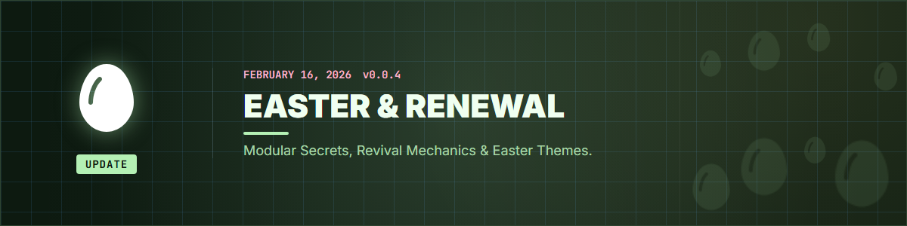

- **Seasonal Theming**: Runtime aesthetic injection.
- **Revival Mechanics**: "Souls-like" death and rebirth systems.
- **Konami Code Support**: Because secrets make games better.

---

## 📜 Update: v0.0.3 — The Romance Update
**March 05, 2026**

  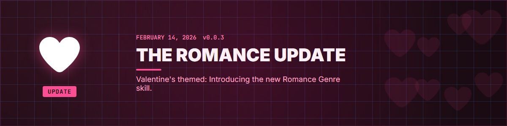

- **Relationship Systems**: Branching affection logic and dating sim blueprints.
- **Unified Romance**: Fully integrated into the Godot Master brain.

---

## 📜 Update: v0.0.2 — Master Skill Evolution
**February 28, 2026**

- **The Orchestrator Born**: `godot-master` becomes the central hub for the ecosystem.
- **Decision Trees**: Integrated architectural guides.

---

## 🏁 The Beginning: v0.0.1 — Initial Launch
**February 15, 2026**

The foundation was laid. 80+ skills, the DIA loop, and a dream of agentic game development. 🌍

---

  <b>Authored by [Divergent AI](https://github.com/thedivergentai)</b>  
  *Keeping Godot development social, fast, and slop-free.*

