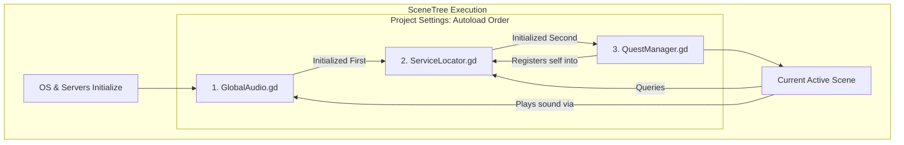

## Godot 4.7 Baseline

- Expert patterns in this skill target **Godot 4.7+** (stable, 2026-06-18).
- Consult the [Godot 4.7 migration guide](https://docs.godotengine.org/en/4.7/tutorials/migrating/upgrading_to_godot_4.7.html) when upgrading projects from 4.6.
- **NEVER** assume 4.6 defaults (stretch mode, audio area_mask, RichTextLabel percent flags) without checking 4.7 migration notes.

# AutoLoad Architecture

AutoLoads are Godot's singleton pattern, allowing scripts to be globally accessible throughout the project lifecycle. This skill guides implementing robust, maintainable singleton architectures.

## Available Scripts

### [static_state_manager.gd](scripts/static_state_manager.gd)
Using `static var` for high-performance global state that doesn't need SceneTree presence.

### [safe_scene_switcher.gd](scripts/safe_scene_switcher.gd)
Robust scene transitioning logic that handles deferred freeing and root-level management.

### [autoload_init_order_diag.gd](scripts/autoload_init_order_diag.gd)
Diagnostic utility for verifying and debugging the initialization sequence of Singletons.

### [global_event_bus.gd](scripts/global_event_bus.gd)
Centralized signal router for decoupling disparate systems (Achievements, Stats, Game Events).

### [persistent_data_holder.gd](scripts/persistent_data_holder.gd)
Pattern for data that must survive `change_scene_to_file()` (Inventory, Settings).

### [lazy_loaded_singleton.gd](scripts/lazy_loaded_singleton.gd)
Memory-efficient singleton pattern that instantiates on-demand rather than at boot.

### [debug_console_autoload.gd](scripts/debug_console_autoload.gd)
CanvasLayer-based debug overlay accessible from any game context.

### [cross_autoload_comms.gd](scripts/cross_autoload_comms.gd)
Expert rules and safety checks for communication between multiple Singletons.

### [thread_safe_global_access.gd](scripts/thread_safe_global_access.gd)
Using Mutex and `call_deferred` to safely access global data from background threads.

### [autoload_reference_checker.gd](scripts/autoload_reference_checker.gd)
Validation utility to ensure Autoloads are correctly registered before attempting access.

## NEVER Do in AutoLoad Architecture

- **NEVER access AutoLoads in `_init()`** — AutoLoads are initialized sequentially. Accessing one in `_init()` may find a null reference [12]. 
- **NEVER modify a Singleton's size or children in `_ready()`** — If multiple Singletons refer to each other's trees during boot, it can cause layout/sorting errors.
- **NEVER store highly localized, scene-specific data in AutoLoads** — This creates "God Objects" and introduces global side effects that are hard to debug [14].
- **NEVER use `Parent.method()` calls from an Autoload** — Autoloads sit at the root. They are the ultimate "top". Use signals to talk to the active scene.
- **NEVER use an Autoload for pure data containers** — If you don't need `_process()` or signals, use a `static var` in a `class_name` script instead [7].
- **NEVER create circular dependencies between Singletons** — If A needs B and B needs A, Godot will hang during the splash screen [13].
- **NEVER free an Autoload node manually** — Removing a singleton from the root can leave dangling references that crash the engine.
- **NEVER use AutoLoads for UI elements that aren't global** — Popups that only exist in one level should be in that level, not a global singleton.
- **NEVER assume `get_tree().current_scene` is accurate in `_ready()`** — In Autoloads, the active scene might still be initializing. Access it via `get_tree().root.get_child(-1)` [6].
- **NEVER skip `process_mode` configuration** — If your global console or music manager needs to work while the game is paused, set `process_mode = PROCESS_MODE_ALWAYS`.


---

## When to Use AutoLoads

**Good Use Cases:**
- **Game Managers**: PlayerManager, GameManager, LevelManager
- **Global State**: Score, inventory, player stats
- **Scene Transitions**: SceneTransitioner for loading/unloading scenes
- **Audio Management**: Global music/SFX controllers
- **Save/Load Systems**: Persistent data management

**Avoid AutoLoads For:**
- Scene-specific logic (use scene trees instead)
- Temporary state (use signals or direct references)
- Over-architecting simple projects

## Implementation Pattern

### Step 1: Create the Singleton Script

**Example: GameManager.gd**
```gdscript
extends Node

# Signals for global events
signal game_started
signal game_paused(is_paused: bool)
signal player_died

# Global state
var score: int = 0
var current_level: int = 1
var is_paused: bool = false

func _ready() -> void:
    # Initialize autoload state
    print("GameManager initialized")

func start_game() -> void:
    score = 0
    current_level = 1
    game_started.emit()

func pause_game(paused: bool) -> void:
    is_paused = paused
    get_tree().paused = paused
    game_paused.emit(paused)

func add_score(points: int) -> void:
    score += points
```

### Step 2: Register as AutoLoad

**Project → Project Settings → AutoLoad**

1. Click the folder icon, select `game_manager.gd`
2. Set Node Name: `GameManager` (PascalCase convention)
3. Enable if needed globally
4. Click "Add"

**Verify in `project.godot`:**
```ini
[autoload]
GameManager="*res://autoloads/game_manager.gd"
```

The `*` prefix makes it active immediately on startup.

### Step 3: Access from Any Script

```gdscript
extends Node2D

func _ready() -> void:
    # Access the singleton
    GameManager.connect("game_paused", _on_game_paused)
    GameManager.start_game()

func _on_button_pressed() -> void:
    GameManager.add_score(100)

func _on_game_paused(is_paused: bool) -> void:
    print("Game paused: ", is_paused)
```

## Best Practices

### 1. Use Static Typing
```gdscript
# ✅ Good
var score: int = 0

# ❌ Bad
var score = 0
```

### 2. Emit Signals for State Changes
```gdscript
# ✅ Good - allows decoupled listeners
signal score_changed(new_score: int)

func add_score(points: int) -> void:
    score += points
    score_changed.emit(score)

# ❌ Bad - tight coupling
func add_score(points: int) -> void:
    score += points
    ui.update_score(score)  # Don't directly call UI
```

### 3. Organize AutoLoads by Feature
```
res://autoloads/
    game_manager.gd
    audio_manager.gd
    scene_transitioner.gd
    save_manager.gd
```

### 4. Scene Transitioning Pattern
```gdscript
# scene_transitioner.gd
extends Node

signal scene_changed(scene_path: String)

func change_scene(scene_path: String) -> void:
    # Fade out effect (optional)
    await get_tree().create_timer(0.3).timeout
    get_tree().change_scene_to_file(scene_path)
    scene_changed.emit(scene_path)
```

## Common Patterns

### Game State Machine
```gdscript
enum GameState { MENU, PLAYING, PAUSED, GAME_OVER }

var current_state: GameState = GameState.MENU

func change_state(new_state: GameState) -> void:
    current_state = new_state
    match current_state:
        GameState.MENU:
            # Load menu
            pass
        GameState.PLAYING:
            get_tree().paused = false
        GameState.PAUSED:
            get_tree().paused = true
        GameState.GAME_OVER:
            # Show game over screen
            pass
```

### Resource Preloading
```gdscript
# Preload heavy resources once
const PLAYER_SCENE := preload("res://scenes/player.tscn")
const EXPLOSION_EFFECT := preload("res://effects/explosion.tscn")

func spawn_player(position: Vector2) -> Node2D:
    var player := PLAYER_SCENE.instantiate()
    player.global_position = position
    return player
```

## Testing AutoLoads

Since AutoLoads are always loaded, **avoid heavy initialization in `_ready()`**. Use lazy initialization or explicit init functions:

```gdscript
var _initialized: bool = false

func initialize() -> void:
    if _initialized:
        return
    _initialized = true
    # Heavy setup here
```

## Expert Architecture Patterns

### 1. Service-Locator-Pattern (Dynamic Registration)
Lightweight alternative to hardcoded Autoloads for dependency management.
- **Why**: Standard Autoloads must be `Node` types, which incur memory and SceneTree overhead [4]. For pure data systems, use `Engine.register_singleton()`.
- **The Script**: Create a `ServiceLocator` autoload at the top of the list.
- **Registration**: Register lightweight `RefCounted` objects globally into the engine's scope [5, 6].

```gdscript
# ServiceLocator.gd (Autoload)
func register_service(name: StringName, service: Object) -> void:
    if not Engine.has_singleton(name):
        Engine.register_singleton(name, service)

func _exit_tree() -> void:
    # Cleanup to prevent dangling pointers [6]
    if Engine.has_singleton(&"CombatService"):
        Engine.unregister_singleton(&"CombatService")
```

- **Consumption**: Other systems fetch services via `Engine.get_singleton(&"Name")`. This bypasses the global variable namespace and allows for O(1) lookups of non-node systems [7].

### 2. Singleton-Dependency-Diagram (Visual Mapping)
Managing the initialization order and coupling of global systems.
- **The Rule**: Autoloads are initialized sequentially in the order they appear in the Project Settings [2]. Singletons at the top of the list MUST NOT depend on those below them.
- **The Template**: Use a Mermaid diagram to map out "Who initializes whom".



- **Verification**: If `SaveManager` (pos 1) calls `PlayerManager` (pos 5) in `_ready()`, it will receive a null reference. Always move managers with dependencies to the bottom of the list.

### 3. Singleton-Health-Check (State Verification)
Automated verification to ensure global states are initialized correctly.
- **The Pattern**: Create a specialized test utility that verifies core singletons are non-null and have their default values reset.
- **Validation**: Use `assert()` for debug-time crashes and `is_instance_valid()` for runtime safety checks [8, 9].

```gdscript
func run_health_checks() -> void:
    # 1. Verify Autoload Node Existence
    var player_vars := get_tree().root.get_node_or_null("PlayerVariables")
    assert(player_vars != null, "Critical Error: PlayerVariables Autoload missing!")
    
    # 2. Verify Dynamic Service Registration
    assert(Engine.has_singleton(&"CombatService"), "Critical Error: CombatService not registered!")
    
    # 3. Verify Memory Safety
    assert(is_instance_valid(player_vars), "Critical Error: PlayerVariables instance invalid!")
```

- **Integration**: Run these checks during game boot (if in debug mode) or within a CI/CD test suite like GUT to prevent state regression.

## Reference
- [Godot Docs: Singletons (AutoLoad)](https://docs.godotengine.org/en/stable/tutorials/scripting/singletons_autoload.html)
- [Best Practices: Scene Organization](https://docs.godotengine.org/en/stable/tutorials/best_practices/scene_organization.html)


### Related
- Master Skill: [godot-master](../godot-master/SKILL.md)
