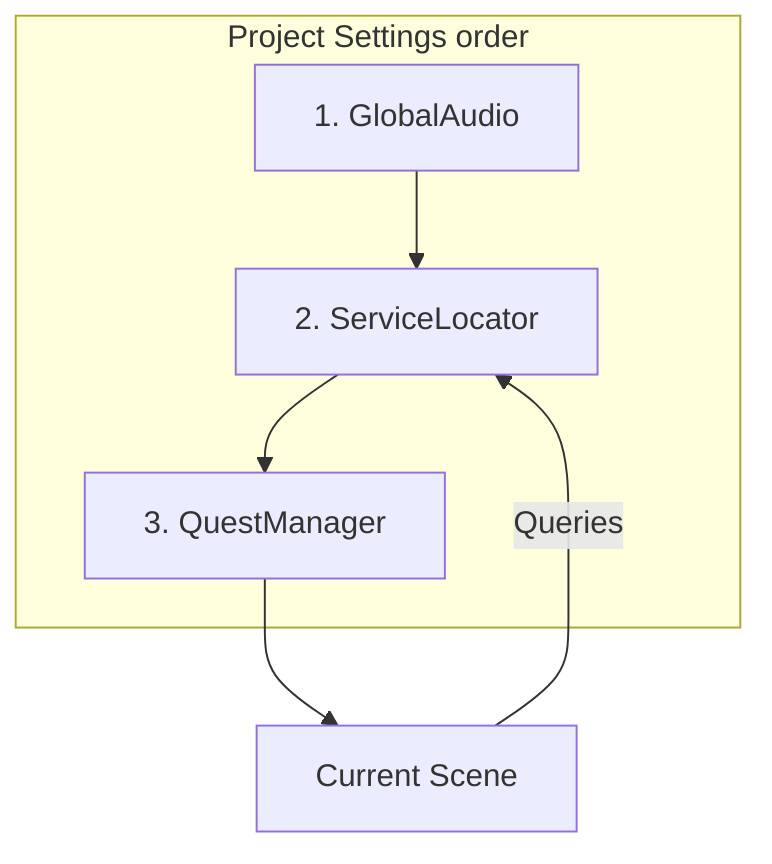

## Godot 4.7 Baseline

- Expert patterns in this skill target **Godot 4.7+** (stable, 2026-06-18).
- Consult the [Godot 4.7 migration guide](https://docs.godotengine.org/en/4.7/tutorials/migrating/upgrading_to_godot_4.7.html) when upgrading projects from 4.6.
- **NEVER** assume 4.6 defaults (stretch mode, audio area_mask, RichTextLabel percent flags) without checking 4.7 migration notes.

# AutoLoad Architecture

Robust singleton ownership, boot order, and cross-scene services — not a Project Settings click-tutorial.

> Basic registration (Project Settings → Autoload, `project.godot` `*` prefix): see [references/autoload-patterns.md](references/autoload-patterns.md). **Do NOT Load** that file for expert work.

## Available Scripts

### [autoload_init_order_diag.gd](scripts/autoload_init_order_diag.gd)
**MANDATORY** before trusting a multi-Autoload dependency graph — verifies boot sequence.

### [singleton_dependency_diagram.gd](scripts/singleton_dependency_diagram.gd)
**MANDATORY** with the mermaid/order diagram — maps who may call whom at boot.

### [global_event_bus.gd](scripts/global_event_bus.gd)
**MANDATORY** before a cross-system Autoload bus (Achievements, UI, Save events).

### [safe_scene_switcher.gd](scripts/safe_scene_switcher.gd)
**MANDATORY** before Autoload-owned scene transitions (deferred free / root management).

### [service_locator.gd](scripts/service_locator.gd) / [service_registry.gd](scripts/service_registry.gd)
**MANDATORY** before `Engine.register_singleton` DI for non-Node services.

### [persistent_data_holder.gd](scripts/persistent_data_holder.gd)
Data that must survive `change_scene_to_file()` (inventory, settings).

### [static_state_manager.gd](scripts/static_state_manager.gd)
`static var` global state when you do **not** need a SceneTree Node.

### [lazy_loaded_singleton.gd](scripts/lazy_loaded_singleton.gd)
On-demand instantiate instead of eager boot cost.

### [cross_autoload_comms.gd](scripts/cross_autoload_comms.gd)
Safe cross-singleton calls after both are ready.

### [thread_safe_global_access.gd](scripts/thread_safe_global_access.gd)
Mutex / `call_deferred` for background threads touching Autoload state.

### [autoload_reference_checker.gd](scripts/autoload_reference_checker.gd) / [singleton_health_check_test.gd](scripts/singleton_health_check_test.gd)
Validate registration + defaults (debug / CI).

### [autoload_bootstrapper.gd](scripts/autoload_bootstrapper.gd) / [autoload_initializer.gd](scripts/autoload_initializer.gd)
Ordered init helpers when `_ready` is too early for heavy work.

### [debug_console_autoload.gd](scripts/debug_console_autoload.gd)
`PROCESS_MODE_ALWAYS` CanvasLayer console.

### [global_game_state.gd](scripts/global_game_state.gd) / [stateless_bus.gd](scripts/stateless_bus.gd)
State holder vs pure event bus split.

## NEVER Do in AutoLoad Architecture

- **NEVER access AutoLoads in `_init()`** — AutoLoads are initialized sequentially. Accessing one in `_init()` may find a null reference.
- **NEVER modify a Singleton's size or children in `_ready()`** — If multiple Singletons refer to each other's trees during boot, it can cause layout/sorting errors.
- **NEVER store highly localized, scene-specific data in AutoLoads** — This creates "God Objects" and introduces global side effects that are hard to debug.
- **NEVER use `Parent.method()` calls from an Autoload** — Autoloads sit at the root. They are the ultimate "top". Use signals to talk to the active scene.
- **NEVER use an Autoload for pure data containers** — If you don't need `_process()` or signals, use a `static var` in a `class_name` script instead.
- **NEVER create circular dependencies between Singletons** — If A needs B and B needs A, Godot will hang during the splash screen.
- **NEVER free an Autoload node manually** — Removing a singleton from the root can leave dangling references that crash the engine.
- **NEVER use AutoLoads for UI elements that aren't global** — Popups that only exist in one level should be in that level, not a global singleton.
- **NEVER assume `get_tree().current_scene` is accurate in `_ready()`** — In Autoloads, the active scene might still be initializing. Access it via `get_tree().root.get_child(-1)`.
- **NEVER skip `process_mode` configuration** — If your global console or music manager needs to work while the game is paused, set `process_mode = PROCESS_MODE_ALWAYS`.

---

## When to Use AutoLoads

**Good:** Game/Audio/Save managers, SceneTransitioner, global score/inventory, cross-scene EventBus.

**Avoid:** Scene-specific logic, temporary state, pure data (prefer `static` / Resource), over-architecting tiny projects.

---

## Expert Architecture Patterns

### 1. Boot order & dependency diagram
> **MANDATORY**: Read [autoload_init_order_diag.gd](scripts/autoload_init_order_diag.gd) and [singleton_dependency_diagram.gd](scripts/singleton_dependency_diagram.gd) before drawing or trusting any Autoload order.

Autoloads initialize **top → bottom** in Project Settings. Upper singletons must not call lower ones in `_ready()`. Move dependents down the list.

### 2. Service locator (non-Node DI)
> **MANDATORY**: [service_locator.gd](scripts/service_locator.gd) / [service_registry.gd](scripts/service_registry.gd) before `Engine.register_singleton`.

Use for lightweight `RefCounted` services; unregister in `_exit_tree` to avoid dangling engine singletons.

### 3. Event bus vs state holder
> **MANDATORY**: [global_event_bus.gd](scripts/global_event_bus.gd) for cross-system past-tense events. Keep mutable run state in [persistent_data_holder.gd](scripts/persistent_data_holder.gd) / [global_game_state.gd](scripts/global_game_state.gd) — not on the bus.

### 4. Safe scene switching from Autoload
> **MANDATORY**: [safe_scene_switcher.gd](scripts/safe_scene_switcher.gd) — deferred free + root ownership. Pair with `godot-scene-management` for threaded loads.

### 5. Health checks
> **MANDATORY** in debug/CI: [singleton_health_check_test.gd](scripts/singleton_health_check_test.gd) / [autoload_reference_checker.gd](scripts/autoload_reference_checker.gd) — `assert` presence + `Engine.has_singleton` for registered services.

## Reference

> Progressive disclosure: open Official Documentation links only when researching a specific API; load Related Skills when routing to a peer domain — do not preload the whole lattice.

### Official Documentation
- [Singletons (AutoLoad)](https://docs.godotengine.org/en/stable/tutorials/scripting/singletons_autoload.html) — How AutoLoads register under `/root`, become global names, and why boot order matches Project Settings list order.
- [Autoloads versus regular nodes](https://docs.godotengine.org/en/stable/tutorials/best_practices/autoloads_versus_regular_nodes.html) — Decision guide for when a global singleton is justified versus a scene-owned node or static helper.
- [Scene organization](https://docs.godotengine.org/en/stable/tutorials/best_practices/scene_organization.html) — Keep scene-local data out of AutoLoads so managers do not become God Objects.
- [Logic preferences](https://docs.godotengine.org/en/stable/tutorials/best_practices/logic_preferences.html) — Prefer signals and ownership edges over reaching into Autoload trees for gameplay orchestration.
- [Using SceneTree](https://docs.godotengine.org/en/stable/tutorials/scripting/scene_tree.html) — Why `current_scene` can be unreliable during Autoload `_ready()` and how root children relate to the active scene.
- [Change scenes manually](https://docs.godotengine.org/en/stable/tutorials/scripting/change_scenes_manually.html) — Deferred free + root reparent patterns behind safe global scene switchers.
- [Pausing games](https://docs.godotengine.org/en/stable/tutorials/scripting/pausing_games.html) — `process_mode` / `PROCESS_MODE_ALWAYS` for consoles, music, and managers that must run while `get_tree().paused`.
- [Overridable functions](https://docs.godotengine.org/en/stable/tutorials/scripting/overridable_functions.html) — `_init` vs `_ready` timing so cross-Autoload access does not hit nulls during sequential boot.
- [Using signals](https://docs.godotengine.org/en/stable/getting_started/step_by_step/signals.html) — Emit/connect model for Autoload event buses that decouple scenes without hard node paths.
- [Engine](https://docs.godotengine.org/en/stable/classes/class_engine.html) — `register_singleton` / `get_singleton` for lightweight service locators that are not SceneTree Nodes.
- [Thread-safe APIs](https://docs.godotengine.org/en/stable/tutorials/performance/thread_safe_apis.html) — Which engine APIs need Mutex/`call_deferred` when background threads touch global Autoload state.
- [Saving games](https://docs.godotengine.org/en/stable/tutorials/io/saving_games.html) — Persistence patterns for inventory/settings held in long-lived Autoload data holders.

### Related Skills

#### Prerequisites
- [godot-project-foundations](https://github.com/thedivergentai/gd-agentic-skills/blob/main/skills/godot-project-foundations/SKILL.md) — AutoLoad entries live in Project Settings / `project.godot`; get registration and naming right before wiring managers.
- [godot-gdscript-mastery](https://github.com/thedivergentai/gd-agentic-skills/blob/main/skills/godot-gdscript-mastery/SKILL.md) — Typed signals, `static var` / `class_name`, and deferred calls are the language tools this skill’s patterns assume.
- [godot-signal-architecture](https://github.com/thedivergentai/gd-agentic-skills/blob/main/skills/godot-signal-architecture/SKILL.md) — Event-bus and Signal-Up contracts for Autoload mediators without circular emit chains.

#### Complements
- [godot-scene-management](https://github.com/thedivergentai/gd-agentic-skills/blob/main/skills/godot-scene-management/SKILL.md) — Pair with safe scene switchers so transitions own loading/unload while AutoLoads keep cross-scene state.
- [godot-save-load-systems](https://github.com/thedivergentai/gd-agentic-skills/blob/main/skills/godot-save-load-systems/SKILL.md) — Serialize what persistent Autoload holders store; do not invent a second save path inside GameManager.
- [godot-resource-data-patterns](https://github.com/thedivergentai/gd-agentic-skills/blob/main/skills/godot-resource-data-patterns/SKILL.md) — Prefer Resources for shared config; reserve AutoLoads for lifecycle + signals, not duplicated data blobs.
- [godot-composition](https://github.com/thedivergentai/gd-agentic-skills/blob/main/skills/godot-composition/SKILL.md) — Component ownership alternative when a “manager Autoload” is really scene-scoped behavior in disguise.
- [godot-audio-systems](https://github.com/thedivergentai/gd-agentic-skills/blob/main/skills/godot-audio-systems/SKILL.md) — Music/SFX pools are classic Autoload homes; use this skill for ownership and boot order around those managers.
- [godot-state-machine-advanced](https://github.com/thedivergentai/gd-agentic-skills/blob/main/skills/godot-state-machine-advanced/SKILL.md) — Global MENU/PLAYING/PAUSED FSMs belong here when the Autoload is only the owner, not the whole game logic dump.
- [godot-debugging-profiling](https://github.com/thedivergentai/gd-agentic-skills/blob/main/skills/godot-debugging-profiling/SKILL.md) — Init-order diagnostics and singleton health checks escalate into debugger/profiler workflows when boot hangs.

#### Downstream / consumers
- [godot-performance-optimization](https://github.com/thedivergentai/gd-agentic-skills/blob/main/skills/godot-performance-optimization/SKILL.md) — Escalate when too many Node Autoloads, eager preloads, or per-frame manager work show up in profilers.
- [godot-testing-patterns](https://github.com/thedivergentai/gd-agentic-skills/blob/main/skills/godot-testing-patterns/SKILL.md) — GUT/CI health checks for registered singletons and reset of global state between tests.
- [godot-multiplayer-networking](https://github.com/thedivergentai/gd-agentic-skills/blob/main/skills/godot-multiplayer-networking/SKILL.md) — Global state Autoloads become authority/replication hazards; consume this skill’s DI patterns carefully online.
- [godot-inventory-system](https://github.com/thedivergentai/gd-agentic-skills/blob/main/skills/godot-inventory-system/SKILL.md) — Typical consumer of persistent Autoload holders for inventory that must survive `change_scene_to_file()`.

#### Master
- [godot-master](https://github.com/thedivergentai/gd-agentic-skills/blob/main/skills/godot-master/SKILL.md) — Library router and mirrored module entry; open when discovering which Domain Skill owns a cross-cutting singleton concern.
