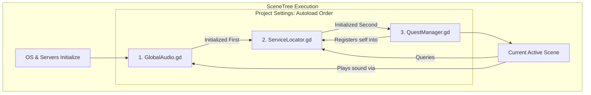

# Expert Patterns

## Best Practices

### 1. Use Static Typing
```gdscript
# ✅ Good
var score: int = 0

# ❌ Bad
var score = 0
```

### 2. Emit Signals for State Changes
```gdscript
# ✅ Good - allows decoupled listeners
signal score_changed(new_score: int)

func add_score(points: int) -> void:
    score += points
    score_changed.emit(score)

# ❌ Bad - tight coupling
func add_score(points: int) -> void:
    score += points
    ui.update_score(score)  # Don't directly call UI
```

### 3. Organize AutoLoads by Feature
```
res://autoloads/
    game_manager.gd
    audio_manager.gd
    scene_transitioner.gd
    save_manager.gd
```

### 4. Scene Transitioning Pattern
```gdscript
# scene_transitioner.gd
extends Node

signal scene_changed(scene_path: String)

func change_scene(scene_path: String) -> void:
    # Fade out effect (optional)
    await get_tree().create_timer(0.3).timeout
    get_tree().change_scene_to_file(scene_path)
    scene_changed.emit(scene_path)
```

## Testing AutoLoads

Since AutoLoads are always loaded, **avoid heavy initialization in `_ready()`**. Use lazy initialization or explicit init functions:

```gdscript
var _initialized: bool = false

func initialize() -> void:
    if _initialized:
        return
    _initialized = true
    # Heavy setup here
```

## Expert Architecture Patterns

### 1. Service-Locator-Pattern (Dynamic Registration)
Lightweight alternative to hardcoded Autoloads for dependency management.
- **Why**: Standard Autoloads must be `Node` types, which incur memory and SceneTree overhead [4]. For pure data systems, use `Engine.register_singleton()`.
- **The Script**: Create a `ServiceLocator` autoload at the top of the list.
- **Registration**: Register lightweight `RefCounted` objects globally into the engine's scope [5, 6].

```gdscript
# ServiceLocator.gd (Autoload)
func register_service(name: StringName, service: Object) -> void:
    if not Engine.has_singleton(name):
        Engine.register_singleton(name, service)

func _exit_tree() -> void:
    # Cleanup to prevent dangling pointers [6]
    if Engine.has_singleton(&"CombatService"):
        Engine.unregister_singleton(&"CombatService")
```

- **Consumption**: Other systems fetch services via `Engine.get_singleton(&"Name")`. This bypasses the global variable namespace and allows for O(1) lookups of non-node systems [7].

### 2. Singleton-Dependency-Diagram (Visual Mapping)
Managing the initialization order and coupling of global systems.
- **The Rule**: Autoloads are initialized sequentially in the order they appear in the Project Settings [2]. Singletons at the top of the list MUST NOT depend on those below them.
- **The Template**: Use a Mermaid diagram to map out "Who initializes whom".



- **Verification**: If `SaveManager` (pos 1) calls `PlayerManager` (pos 5) in `_ready()`, it will receive a null reference. Always move managers with dependencies to the bottom of the list.

### 3. Singleton-Health-Check (State Verification)
Automated verification to ensure global states are initialized correctly.
- **The Pattern**: Create a specialized test utility that verifies core singletons are non-null and have their default values reset.
- **Validation**: Use `assert()` for debug-time crashes and `is_instance_valid()` for runtime safety checks [8, 9].

```gdscript
func run_health_checks() -> void:
    # 1. Verify Autoload Node Existence
    var player_vars := get_tree().root.get_node_or_null("PlayerVariables")
    assert(player_vars != null, "Critical Error: PlayerVariables Autoload missing!")
    
    # 2. Verify Dynamic Service Registration
    assert(Engine.has_singleton(&"CombatService"), "Critical Error: CombatService not registered!")
    
    # 3. Verify Memory Safety
    assert(is_instance_valid(player_vars), "Critical Error: PlayerVariables instance invalid!")
```

- **Integration**: Run these checks during game boot (if in debug mode) or within a CI/CD test suite like GUT to prevent state regression.
